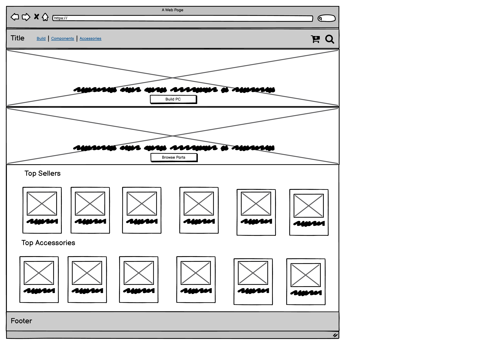

# T2A3

## Links

- [Project Repository](https://github.com/cody-sam/T3A2)
- [Application Repository](https://github.com/cody-sam/app)
- [API Repository](https://github.com/cody-sam/api)

## User Testing

### [Higher Quality PDF Version](./docs/User-Testing.pdf)

### Embedded Images

click to view

---

## R1. Description of your website

### Purpose

A local computer building business is looking to provide their customers with a better user experience when buying a PC. Right now, the buying process for a customer looking to build a computer is done with direct communication between the business and the customer, either verbally or over text online. This is inefficient for the business and is also error prone. In order to expand, the business needs a solution to allow customers to build their own computers, 24 hours of the day, in a simple way.

The purpose of "PC BUILDER 9001" is to solve these issues, by allowing customers to build their own PC, online, with an easy to use interface, and have the order paid for and sent to the business completely autonomously.

### Functionality / features

#### Minimum Viable Product

- PC builder application
- Allow selection of each component of the PC
- Application manages compatibility of each component
- User registration/accounts to promote returning customers
- Admin controls for user accounts/parts/orders
- Parts stored in database can be created/modified with an easy to use admin interface
- Store front for buying loose parts/components
- Payment processing using Stripe
- Live chat between customer and business for any enquiries

#### Stretch goals

- Auto invoice email after order
- Part comparison allowing customers to compare two parts, see performance differences between the two and make an informed decision
- Visual representation of each part being ordered
- 3D representation of parts/computer as being built

### Target audience

The target audience is people looking to buy a custom PC. The easy to use interface is aiming to tailor to people who might not have much experience or knowledge around custom PC's, and aims to onboard a lot of first time PC builders.

### Tech stack

Most of the application development is centered around the MERN stack. The MERN stack utilises React to build the front end, Express and Node to build the back end infrastructure and MongoDB for data storage. The application will also need to utilise a number of other applications and services to deliver all functionality and features. A full list of technology used:

#### Client Side

- MongoDB
- Express
- React
- Node
- Cloudinary
- Stripe
- Auth0
- JEST
- Heroku
- Github

## R2. Dataflow Diagram

### [Higher Quality PDF Version](./docs/data_flow_diagrams.pdf)

### Embedded Images

click to view

---

Application Overview

---

User Management

---

Shop Front

---

Manage Cart

---

Checkout

---

Manage Orders

---

Admin Panel

## R3. Application Architecture Diagram

### [Higher Quality PDF Version](./docs/application_architecture_diagram.pdf)

### Embedded Image

click to view

## R4. User Stories

### As a customer who lacks experience in building PC's I would:

- like to be able to have a custom PC built for me so I can have a PC that best suits my needs
- like to be able to be able to design my PC using a interface so that I can visualise what parts are still required
- like to be told what parts are compatible with my current build so that I don't have to spend time researching myself
- like to be able to compare similar items so that I can make the best decisions about what parts to use
- like to be able to save my build so that I can come back later to finish it and/ or purchase it
- like to be able to share my build with others so I can get feedback from them
- like to be able to customise how my PC looks as well as the parts used in it so I can make it personalise to me
- like to be able to purchase my build and have it sent to me so that I can have a custom PC built without me knowing how to do it

### As a customer who has experience with building PC's I would:

- like to be able to shop for parts normally so I don't waste time with an app or interface that I don't need
- like to be able to create separate lists of parts for different potential builds so that I can keep track of parts I am interested in
- like to be able to save these builds so I can come back to them later to make changes or to purchase them
- like to be able to share these builds with others so I can get feedback from them
- like to be able to compare parts to each other in the store so that I don't need to open other windows to compare them
- like the option to be able to filter out parts that are not compatible with already selected parts

### As a customer who has ordered a custom PC or purchased parts I would:

- like to be able to see the progress of my order for peace of mind it is being processed
- like to be able to view tracking details once the parcel has be shipped so that I can see how far away it is
- like to be able to request changes to an order that has not been processed so that I can add or remove items if I changed my mind
- like to be able to leave feedback on my experience so that others can have a better experience

### As a vendor I:

- need to be able to add or remove items from the store so that the store reflects what I can actually sell
- need to be able to manage stock levels so that customers can have the most up to date information when shopping
- need to be able to inform customers of the progress of their order so that customers don't have to get in contact with me to find this information
- would like to be notified of new orders so that I can begin processing as soon as practical
- would like to be able to track product popularity so I can avoid stocking products that wont sell

## R5. Wireframes for multiple standard screen sizes, created using industry standard software

Initial wireframes were submitted for review to the client. We received some feedback regarding the amount of wireframes for the admin functionality. Upon receiving the feedback we made some changes and the client was satisfied.

### [Higher Quality PDF Version](./docs/wireframes.pdf)

### Embedded Images

click to view

#### Original Wireframes

Landing Page

Build A PC

Build A PC - Peripherals

Purchase Build 

Browse Items

Admin Panel - Product Edit

#### Post Feedback Additions

<!--  -->

Admin Panel - View Orders

Admin Panel - Process An Order

Admin Panel - Sales Statistics

## R6. Screenshots of your Trello board throughout the duration of the project

### 5th July 2022

### 7th July 2022

### 8th July 2022

### 10th July 2022

### 12th July 2022

### 20th July 2022

### 21th July 2022

### 22th July 2022

